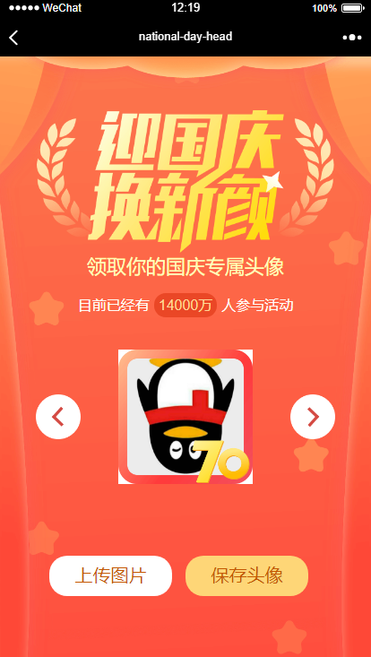

<p align="center">

</p>

<h3 align="center">用vue构建微信国庆头像生成工具</h3>

<p align="center">
  <a href="">
    更新日志
  </a>
  <span> | </span>
  <a href="./README_EN.md">
    English
  </a>
  <span> | </span>
  <a>
    中文
  </a>
</p>

> 基于 Vue2.6x 构建微信国庆头像生成工具

## 更新日志

2019-09-26 创建项目 
注意：目前核心代码并未上传，可先Fork，预计2019-09-27号更新完毕, 再 Clone or download，本地运行

## 贡献
 有兴趣的同学可以切一个分支（以您的github账号命名分支），发起 pull request 

## 核心实现原理

- **获取或者上传微信头像** 
- **Canvas实现绘图和头像合成：** Canvas实现定位绘图，以及两张图片的合成
- **保存合成的图片** 将图片转换为base64，保存头像

## 支持性

支持微信h5页面

## 项目设置
```
npm install
```

### 编译和热更新用于开发
```
npm run dev
```

## License

[MIT](http://opensource.org/licenses/MIT)
